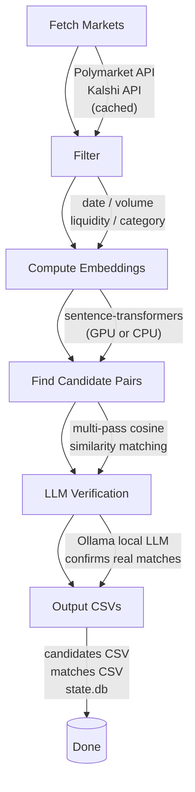

# Market Matcher

Finds matching prediction markets between **Polymarket** and **Kalshi** and flags potential arbitrage opportunities.

## How It Works



## Setup

```bash
pip install -r requirements.txt
brew install ollama        # or https://ollama.ai/download
ollama pull qwen2.5:7b
```

## Usage

```bash
python arb_matcher.py              # normal run (uses cache)
python arb_matcher.py --fresh      # ignore cache, re-fetch from APIs
python arb_matcher.py --resume     # resume LLM verification from last run
```

Progress is saved after every candidate — safe to `Ctrl+C` and resume later.

## Configuration

Edit the `Config` dataclass at the top of `arb_matcher.py`. Key knobs:

| Setting | Default | What it does |
|---|---|---|
| `days_until_max_end` | 30 | Only markets resolving within N days |
| `polymarket_min_volume` | 5000 | Min volume filter |
| `embedding_model` | `gte-large-en-v1.5` | Sentence-transformer model |
| `embedding_device` | `cuda` | `cuda` for GPU, `cpu` for CPU |
| `title_only_threshold` | 0.88 | Cosine sim for title-only match |
| `llm_model` | `qwen2.5:7b` | Ollama model for verification |

## Output

All output goes to `./data/`:

| File | Description |
|---|---|
| `arb_candidates_*.csv` | Pre-LLM candidate pairs |
| `arb_matches_*.csv` | Confirmed matches per run |
| `arb_matches_all.csv` | Cumulative match history |
| `state.db` | SQLite state for dedup & resume |

### Arb Columns

- **pykn** — Poly YES + Kalshi NO. If < 1.0 → buy YES on Poly, NO on Kalshi.
- **kypn** — Kalshi YES + Poly NO. If < 1.0 → buy YES on Kalshi, NO on Poly.
