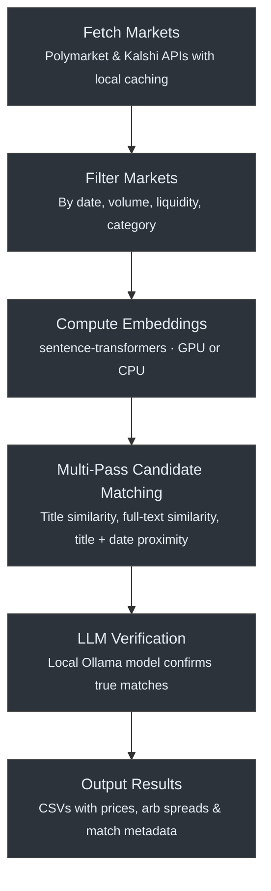

# Market Matcher

Cross-venue arbitrage detector for prediction markets. Fetches active markets from **Polymarket** and **Kalshi**, identifies semantically equivalent markets using embeddings, verifies matches with a local LLM, and surfaces pricing discrepancies that may represent arbitrage opportunities.

## Execution Flow



## Setup

```bash
pip install -r requirements.txt
brew install ollama            # or see https://ollama.ai/download
ollama pull qwen2.5:7b
```

## Usage

```bash
python arb_matcher.py              # normal run (uses cache if fresh)
python arb_matcher.py --fresh      # force re-fetch from both APIs
python arb_matcher.py --resume     # skip embeddings, resume LLM verification
```

All progress is persisted to a SQLite database after every candidate, so it's safe to `Ctrl+C` and pick up where you left off with `--resume`.

## How It Works

1. **Fetch** — Pulls all active markets from the Polymarket Gamma API and the Kalshi trading API. Responses are cached locally to avoid redundant fetches within a configurable window (default 4 hours).

2. **Filter** — Applies configurable filters: resolution date range, minimum volume, minimum liquidity, and optional category include/exclude lists. Reduces the search space to markets worth comparing.

3. **Embed** — Generates vector embeddings for each market using a sentence-transformer model (`gte-large-en-v1.5` by default). Both title-only and full-text (title + description + rules + resolution date) embeddings are computed. Can run in a subprocess to cleanly release GPU memory afterward.

4. **Match** — Runs a multi-pass cosine similarity search across Polymarket × Kalshi embedding pairs:
   - **Pass 1:** High title similarity (≥ 0.88)
   - **Pass 2:** High full-text similarity (≥ 0.85)
   - **Pass 3:** Moderate title similarity (≥ 0.75) combined with close resolution dates (within 3 days)

5. **Verify** — Each candidate pair is sent to a local LLM (Ollama, `qwen2.5:7b`) that evaluates whether the two markets ask the same question and would resolve the same way. Results are saved incrementally.

6. **Output** — Verified matches are written to timestamped CSVs and a cumulative `arb_matches_all.csv`. Each row includes prices from both venues and pre-computed arb spread columns.

## Configuration

All settings live in the `Config` dataclass at the top of `arb_matcher.py`:

| Setting | Default | Description |
|---|---|---|
| `days_until_max_end` | `30` | Only include markets resolving within this many days |
| `polymarket_min_volume` | `5000` | Minimum volume to consider a Polymarket market |
| `kalshi_min_volume` | `5000` | Minimum volume to consider a Kalshi market |
| `embedding_model` | `gte-large-en-v1.5` | Sentence-transformer model for embeddings |
| `embedding_device` | `cuda` | `cuda` for GPU, `cpu` for CPU |
| `title_only_threshold` | `0.88` | Cosine similarity threshold for title-only matching |
| `full_text_threshold` | `0.85` | Cosine similarity threshold for full-text matching |
| `llm_model` | `qwen2.5:7b` | Ollama model used for match verification |
| `cache_expiry_minutes` | `240` | How long cached API responses stay valid |

## Output

All output is written to `./data/`:

| File | Description |
|---|---|
| `arb_candidates_<timestamp>.csv` | Candidate pairs from embedding similarity (pre-LLM) |
| `arb_matches_<timestamp>.csv` | LLM-confirmed matches for a single run |
| `arb_matches_all.csv` | Cumulative history of all confirmed matches |
| `state.db` | SQLite database tracking processed pairs for dedup and resume |

### Arbitrage Spread Columns

Each match row includes pre-computed cross-venue spread values:

- **`pykn`** — Polymarket YES price + Kalshi NO price. If < 1.0, buying YES on Polymarket and NO on Kalshi is profitable regardless of outcome.
- **`kypn`** — Kalshi YES price + Polymarket NO price. If < 1.0, buying YES on Kalshi and NO on Polymarket is profitable regardless of outcome.
